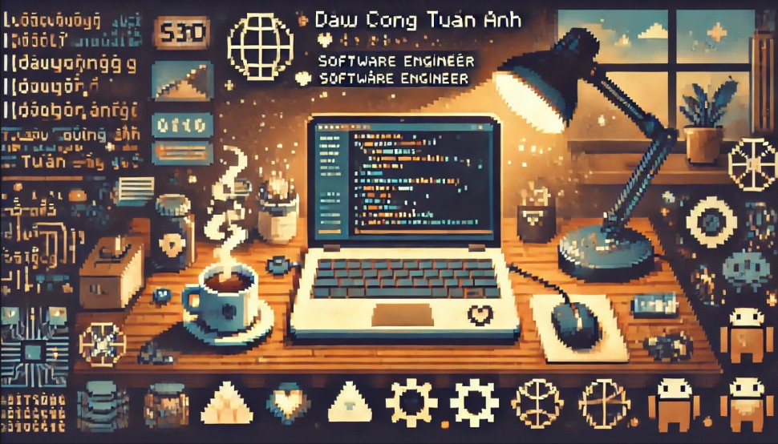

<div align="center">
    


[](https://www.linkedin.com/in/dau-tuan-anh-872b091a6/) &nbsp;
[](https://medium.com/@tuananhdaucong) &nbsp;
[](mailto:tuananhdaucong@gmail.com)

</div>

- 🔭 I’m currently studying on ITMO university
- 🌱 I’m passionate about <b>System architecture</b>,<b>Oracle Ecosystem</b>,<b>Database system</b> and <b>Japanese</b>  
- 📝 I’m aiming to write one article per week starting from Dec 24.
- 📈 I’m aiming to solve Leetcode everyday starting from Dec 25.
- 🏆 I'm striving to increase my GitHub stats rating by contributing to open source.

<div align="center">
    
## 💻 My Tech Stack:

[](https://skillicons.dev)

## 💡 A Quote:

```
Fear is not real
```

## 🏆 My Stats:

<p>
    &nbsp;&nbsp;
    &nbsp;&nbsp;
</p>
